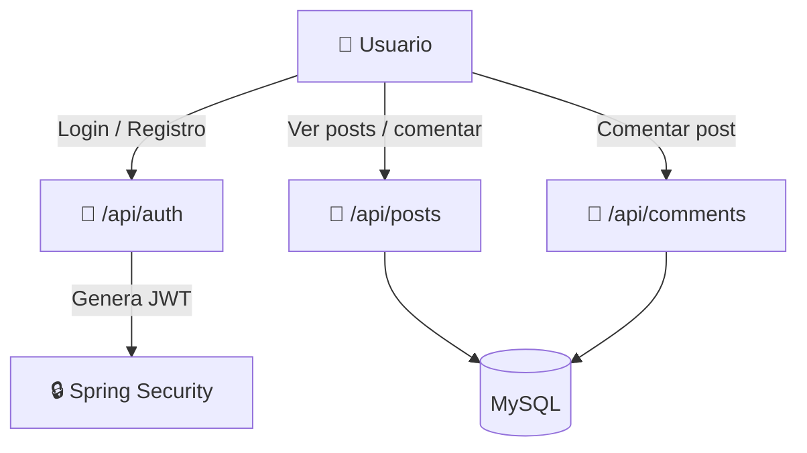

# 📝 Blog API con Spring Boot + JWT + Docker

Este proyecto es una API REST para gestionar publicaciones y comentarios de un blog.  
Cuenta con autenticación mediante **JWT (Json Web Tokens)** y control de acceso por roles (**ADMIN** y **USER**).  
Además, está contenida y orquestada usando **Docker** y **MySQL**.

---

## ⚙️ Tecnologías usadas

- Java 17
- Spring Boot
- Spring Security + JWT
- Spring Data JPA + Hibernate
- MySQL
- MapStruct
- Docker + Docker Compose

---

## 🧩 Arquitectura del sistema



## 📁 Estructura del proyecto
```csharp
blog-jwt/
├── controller/              # Controladores REST
├── entity/                  # Entidades JPA
├── repository/              # Repositorios JPA
├── service/                 # Lógica de negocio
├── dto/                     # DTOs de entrada y salida
├── security/                # Configuración JWT y filtros
├── mapper/                  # MapStruct para conversión
├── init.sql                 # Script de inicialización MySQL
├── Dockerfile               # Imagen del backend
├── docker-compose.yml       # Orquestación con base de datos
└── application.properties   # Configuración de la app
```

## 🔐 Seguridad con JWT
Esta API está protegida mediante Spring Security y JWT.
Los usuarios deben autenticarse para obtener un token que deben enviar en el header:

- Authorization: Bearer <token>

## 📦 Endpoints principales
### 🔐 Autenticación (/api/auth)
| Método | Endpoint  | Descripción                 |
| ------ | --------- | --------------------------- |
| POST   | /register | Registro de nuevos usuarios |
| POST   | /login    | Login y generación de JWT   |

### 📝 Publicaciones (/api/posts)
| Método | Endpoint | Descripción               | Requiere Token |
| ------ | -------- | ------------------------- | -------------- |
| GET    | /        | Listar todos los posts    | ❌              |
| POST   | /        | Crear nuevo post          | ✅ (ADMIN)      |
| PUT    | /{id}    | Actualizar post existente | ✅ (ADMIN)      |
| DELETE | /{id}    | Eliminar post             | ✅ (ADMIN)      |

### 💬 Comentarios (/api/comments)
| Método | Endpoint      | Descripción                   | Requiere Token |
| ------ | ------------- | ----------------------------- | -------------- |
| GET    | /?postId={id} | Listar comentarios de un post | ❌              |
| POST   | /?postId={id} | Agregar comentario a un post  | ✅ (USER/ADMIN) |

## ▶️ Cómo ejecutar el proyecto
### ✅ Requisitos previos
- Tener instalado Docker y Docker Compose
🚀 Pasos para levantar el proyecto
```bash
git clone https://github.com/admf20/blog-jwt.git
cd blog-jwt
docker-compose up --build
```
- La aplicación estará disponible en: http://localhost:8080
- La base de datos se levanta en MySQL (puerto 3306)
- Las tablas se crean automáticamente con init.sql
## 🛑 Para detener los servicios
```bash
docker-compose down

```
